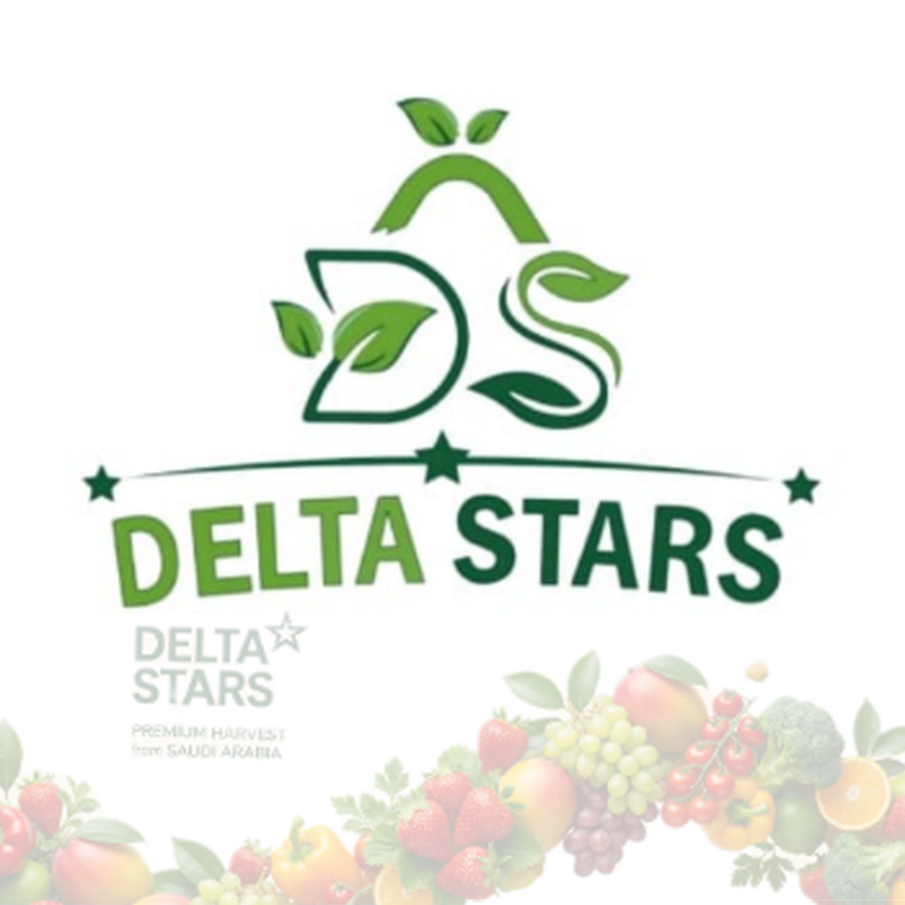

<div align="center">
  

  # 🌟 نجوم دلتا للتجارة
  ### Delta Stars Trading — 
  
متجر إلكتروني احترافي 
شريكك المثالي للخضروات والفواكة والتمور عالية الجودة في المملكة العربية السعودية 
  [](https://deltastars.store)
  
  
  
  

</div>

---

## 🗂 هيكل المشروع

```
delta-stars/
├── src/
│   ├── components/          # مكونات React (70+ مكون)
│   │   ├── AdminDashboardPage.tsx
│   │   ├── AiAssistant.tsx  # المساعد الذكي عدي
│   │   ├── Checkout.tsx     # صفحة الدفع (Moyasar)
│   │   ├── Header.tsx
│   │   ├── Footer.tsx
│   │   ├── HomePage.tsx
│   │   ├── ShowroomPage.tsx
│   │   └── lib/
│   │       ├── contexts/    # السياقات (Firebase, Gemini, i18n...)
│   │       └── services/    # الخدمات الداخلية
│   ├── contexts/            # AppContext, AuthContext, Notifications
│   ├── services/            # API, Payment, Maps, SMS
│   ├── hooks/               # useCart, useProducts, useLocation
│   ├── firebase.ts          # Firebase + Firestore + FCM
│   ├── supabaseClient.ts    # Supabase client
│   └── constants.ts         # بيانات الشركة + الفروع
├── netlify/functions/       # Serverless Functions
│   ├── otp-send.mjs         # إرسال OTP — Authentica.sa
│   ├── otp-verify.mjs       # التحقق من OTP
│   ├── otp-notify.mjs       # إشعارات الطلبات بالرسائل
│   ├── create-payment-intent.mjs  # إنشاء معاملة دفع
│   ├── verify-payment.mjs         # التحقق من الدفع
│   ├── cancel-payment.mjs         # إلغاء الدفع
│   └── payment-webhook.mjs        # Moyasar Webhook
├── public/                  # Assets & PWA files
├── .github/workflows/       # CI/CD
├── netlify.toml
├── vercel.json
├── capacitor.config.json    # إعدادات التطبيق
└── .env.local               # ⚠️ لا ترفعه على Git
```

---

## ⚡ التشغيل المحلي

```bash
# 1. استنساخ المشروع
git clone https://github.com/your-org/delta-stars.git
cd delta-stars

# 2. تثبيت المكتبات
npm install --legacy-peer-deps

# 3. نسخ ملف البيئة
cp .env.example .env.local
# ثم أضف مفاتيحك في .env.local

# 4. تشغيل بيئة التطوير
npm run dev
```

---

## 🚀 النشر على Netlify

### الطريقة الأولى — واجهة الويب:
1. اذهب إلى [netlify.com](https://netlify.com)
2. **New Site from Git** → اختر المستودع
3. **Build command:** `npm run build:netlify`
4. **Publish directory:** `dist`
5. أضف متغيرات البيئة في **Site Settings → Environment Variables**

### الطريقة الثانية — رفع مباشر:
1. شغّل `npm run build:netlify` محلياً
2. اسحب مجلد `dist/` وأفلته في [app.netlify.com](https://app.netlify.com)

---

## 🚀 النشر على Vercel

```bash
npm i -g vercel
vercel --prod
```

أو ربط المستودع مباشرةً من [vercel.com](https://vercel.com)

---

## 🔑 متغيرات البيئة المطلوبة

| المتغير | الوصف | موقع الإضافة |
|---------|-------|-------------|
| `VITE_SUPABASE_URL` | رابط Supabase | Frontend |
| `VITE_SUPABASE_ANON_KEY` | مفتاح Supabase العام | Frontend |
| `VITE_GEMINI_KEY` | مفتاح Gemini AI (عدي) | Frontend |
| `VITE_MAPS_KEY` | Google Maps API | Frontend |
| `VITE_MOYASAR_PUBLISHABLE_KEY` | مفتاح Moyasar العام | Frontend |
| `VITE_FIREBASE_API_KEY` | Firebase API Key | Frontend |
| `VITE_FIREBASE_VAPID_KEY` | VAPID (Push Notifications) | Frontend |
| `MOYASAR_SECRET_KEY` | مفتاح Moyasar السري | Netlify/Vercel فقط |
| `AUTHENTICA_API_KEY` | مفتاح Authentica.sa | Netlify/Vercel فقط |
| `AUTHENTICA_API_SECRET` | سر Authentica.sa | Netlify/Vercel فقط |

---

## 📱 بناء التطبيق (Capacitor)

```bash
# بناء الويب أولاً
npm run build:netlify

# مزامنة مع Capacitor
npx cap sync

# فتح Android Studio
npx cap open android

# فتح Xcode
npx cap open ios
```

---

## 🏢 معلومات الشركة

| | |
|--|--|
| **الاسم** | شركة نجوم دلتا للتجارة |
| **الهاتف** | 920023204 |
| **البريد** | INFO@DELTASTARS-KSA.COM |
| **الموقع** | https://deltastars.store |
| **الدومين الشركي** | https://deltastars-ksa.com |

---

## 🔒 الأمان

- ✅ مفاتيح السر في Netlify env فقط — لا تظهر في الكود
- ✅ CSP headers محكمة
- ✅ HTTPS إلزامي
- ✅ JWT + OTP للمصادقة
- ✅ Firestore Security Rules
- ✅ Rate limiting على OTP

---

*© 2025 شركة نجوم دلتا للتجارة
جميع الحقوق محفوظة*
